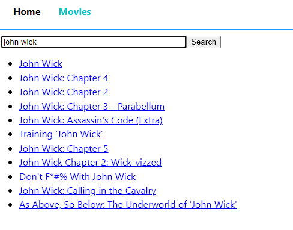

# Search Movies App - project

- This is a React-based web application that leverages React and JavaScript. The application allows users to search for movies, displaying relevant details such as movie posters, titles, release dates, descriptions, cast and comments upon selection. The main page showcases currently popular movies.
- Live version [_here_](https://pawelwiteckiwawrzyniak.github.io/search-movies-app-react-project/).

## Table of Contents

- [General Info](#general-information)
- [Technologies Used](#technologies-used)
- [Project Features](#project-features)
- [Project Objectives](#project-objectives)
- [Setup](#setup)

## General Information

- This is a project created to expand knowledge and gain
  experience in web app development.

## Technologies Used:

- JavaScript
- React and ReactDOM

## Project Features:

- Movie Search:
  - Users can search for movies, triggering the display of relevant details such as posters, titles, release dates, and descriptions.
    
- Detailed Movie Information:
  - Upon selecting a movie, users can view additional information, including comments and cast details.
    
    
- Popular Movies Showcase:
  - The main page highlights currently popular movies, offering users an engaging selection.
    
- Lazy Loading for Enhanced Performance:
  - Lazy imports are implemented for efficient code splitting, optimizing the loading of components as needed.
    
## Project Objectives:

- React Efficiency:
  - Utilizing React for the efficient creation of dynamic and responsive user interfaces.
- Code Splitting with Lazy Imports:
  - Implementing lazy imports for optimized loading and improved performance.
- Asynchronous Data Fetching:
  - Employing asynchronous fetch for efficient retrieval of movie data.
- Enhanced User Experience:
  - Designing a dynamic and interactive user interface for seamless exploration of movie details.

## Setup

To run this project, install it locally using npm:

```
npm i
npm start
```
